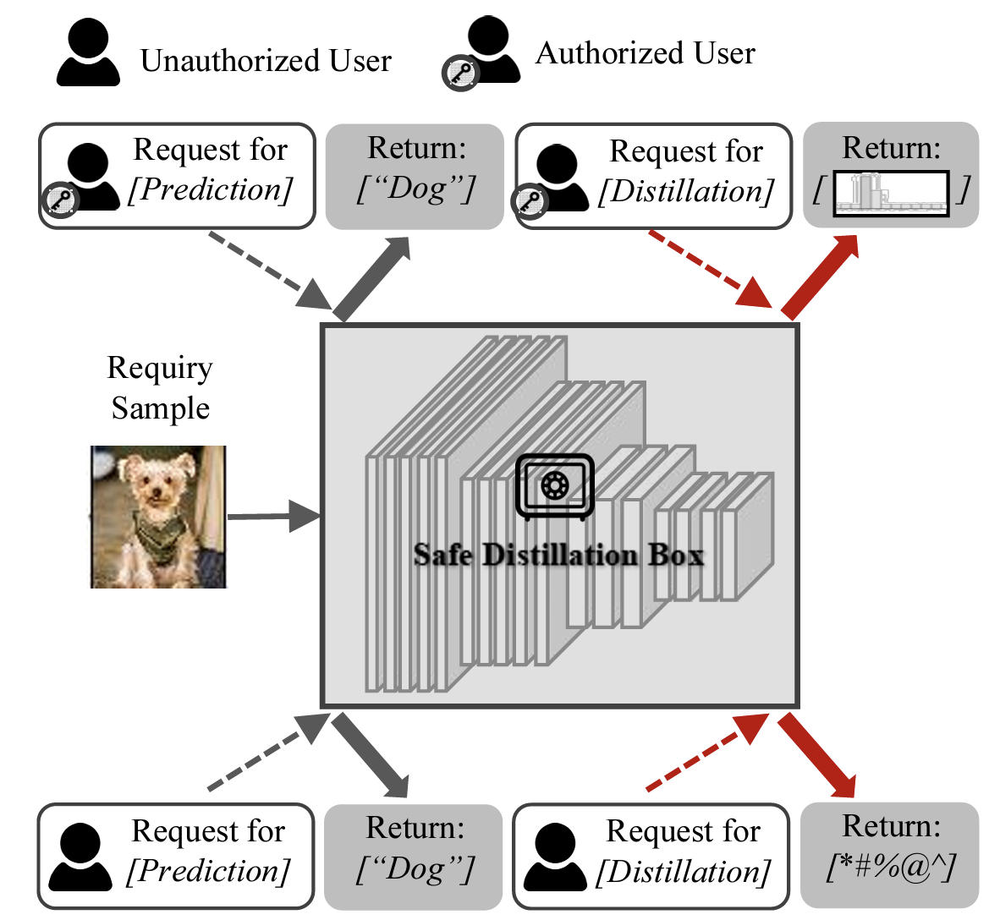

<div align="center"> 

# Safe Distillation Box（ECCV 2022）

[Jingwen Ye](https://scholar.google.com/citations?user=8GQnNP0AAAAJ&hl=en),
Yining Mao,
[Jie Song](https://scholar.google.com/citations?hl=en&user=4OjO-WYAAAAJ),
[Xinchao Wang](https://scholar.google.com/citations?user=w69Buq0AAAAJ&hl=en&oi=ao),
[Cheng Jin](https://scholar.google.com/citations?user=5SCSiKwAAAAJ&hl)
and [Mingli Song](https://scholar.google.com/citations?hl=en&user=7oLbhAwAAAAJ)

[[Arxiv]](https://arxiv.org/abs/2112.03695)

</div>

This repository is an official PyTorch implementation of the paper
[**『 Safe Distillation Box 』**](https://arxiv.org/abs/2112.03695).
It provides a framework for Model IP Protection.

<p align="center">
  
</p>


If you use the code/model/results of this repository please cite:
```
@inproceedings{ye2022safe,
  title={Safe distillation box},
  author={Ye, Jingwen and Mao, Yining and Song, Jie and Wang, Xinchao and Jin, Cheng and Song, Mingli},
  booktitle={Proceedings of the AAAI Conference on Artificial Intelligence},
  volume={36},
  number={3},
  pages={3117--3124},
  year={2022}
}
```


## Overview 

* We build this code based on the previous work Nasty Teacher, thanks to their great work!
* We propose a simple yet efficient algorithm, called **Safe Distillation Box**, to protect the knowledge in a key-based manner.

## Prerequisite
We use Pytorch 1.4.0, and CUDA 10.1. You can install them with  
~~~
conda install pytorch=1.4.0 torchvision=0.5.0 cudatoolkit=10.1 -c pytorch
~~~   
It should also be applicable to other Pytorch and CUDA versions.  


Then install other packages by
~~~
pip install -r requirements.txt
~~~

## Usage 


### Teacher networks 

##### Step 1: Train a normal teacher network   

~~~
python train_scratch.py --save_path [XXX]
~~~
Here, [XXX] specifies the directory of `params.json`, which contains all hyperparameters to train a network.
We already include all hyperparameters in `experiments` to reproduce the results in our paper.    

For example, normally train a ResNet18 on CIFAR-10  
~~~
python train_scratch.py --save_path experiments/CIFAR10/baseline/resnet18
~~~
After finishing training, you will get `training.log`, `best_model.tar` in that directory.  
   
The normal teacher network will serve as the **adversarial network** for the training of the nasty teacher. 


##### Step 2: Train a SDB teacher network
~~~
python train_smb.py --save_path [XXX]
~~~
Again, [XXX] specifies the directory of `params.json`, 
which contains the information of adversarial networks and hyperparameters for training.  
You need to specify the architecture of adversarial network and its checkpoint in this file. 

 
For example, train a nasty ResNet18
~~~
python train_smb.py --save_path experiments/CIFAR10/kd_nasty_resnet18/nasty_resnet18
~~~

note that SDB teacher is the key-based undistillation teacher,
nasty teacher is undistillable for all the inputs. 

### Knowledge Distillation for Student networks 

You can train a student distilling from normal or nasty teachers by 
~~~
python train_kd.py --save_path [XXX]
python train_kd_noise.py --save_path [XXX]
~~~
Again, [XXX] specifies the directory of `params.json`, 
which contains the information of student networks and teacher networks
 

